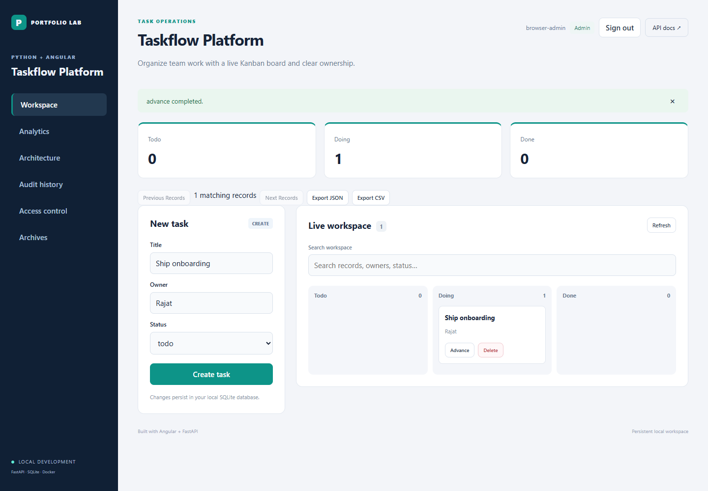

# Taskflow Platform

Organize team work with a live Kanban board and clear ownership. Python FastAPI and Angular application with persistent local data and a container deployment path.

## Engineering focus

**Owned Kanban transitions.** A team lead assigns an owner and follows a task through the delivery workflow.

Tasks start in todo, advance through doing to done, and cannot advance beyond completion.

The implementation includes cookie authentication, viewer/editor/administrator roles, CSRF checks, atomic audit events, optimistic concurrency, durable idempotent creates, soft deletion, database migrations, structured request logs and paginated APIs. Each repository runs independently.



[Mobile view](docs/mobile.png) · [Audit history](docs/audit.png) · [Architecture](docs/architecture.md) · [API contract](docs/api-contract.md) · [Operations](docs/runbook.md)

## Run locally

Python 3.13 and Node.js 22 are used in CI. Install dependencies once; the application itself needs no cloud account or API key.

```sh
python -m venv .venv
# PowerShell: .venv/Scripts/Activate.ps1
# macOS/Linux: source .venv/bin/activate
python -m pip install -r requirements-dev.txt
cd frontend
npm ci
npm run build
cd ..
python manage.py migrate
python manage.py create-admin --username local-admin
python run.py
```

The admin command prompts for a password; use at least 12 characters. Open http://127.0.0.1:8101 and sign in. Local self-registration creates an editor account. API schema: http://127.0.0.1:8101/docs. Data persists in `data/app.db`.

For Angular live reload, run `npm start` in `frontend/` alongside the Python server. Its development proxy keeps API and cookie traffic on the browser's origin.

## Verify and deploy

```sh
python -m unittest -v
docker compose config
docker compose run --rm --build app python manage.py create-admin --username local-admin
docker compose up --build
```

GitHub Actions runs the domain/security/concurrency tests, installs the pinned Angular lockfile, builds Angular and builds the non-root Docker image. Kubernetes examples are under `deploy/`; read the runbook before adapting them to a cluster.

## Example domain input

```json
{
  "title": "Ship onboarding",
  "owner": "Rajat",
  "status": "todo"
}
```

Business fields are separate from server metadata: `id`, `version` (integer revision) and `created_at`. Writes use `If-Match`; retryable creates use `Idempotency-Key`.

## Scope

This is an engineering portfolio reference application. It demonstrates implemented design choices and failure handling; it does not claim live customer traffic or a production operating history. Deployment uses one workspace and one SQLite writer. See the documented tradeoffs and hardening work in the architecture and runbook.

## Workspace enhancements

The workspace pages through 50 records at a time and exports the current filter as JSON or CSV. Exports include active records only and are bounded to 5000 rows; CSV formula-like cells are neutralized. Administrators can browse archived records and restore their original ID and workflow state. Restoration requires the current revision, commits an audit event atomically, and rejects conflicting active identities or bookings.
