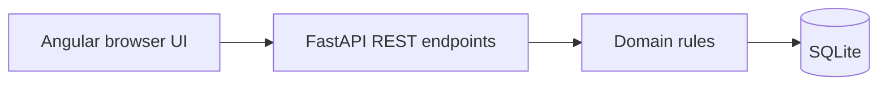

# Team Taskboard — Python + Angular

Organize team work with a live Kanban board and clear ownership.

**Stack:** Python 3.11+, FastAPI, Uvicorn, Angular 21, TypeScript, RxJS, reactive forms, SQLite, Docker, Kubernetes, GitHub Actions.

## Screenshots


[View the mobile dashboard](docs/mobile.png).

## Run locally

Requires Python 3.11+ and Node.js 20.19+, 22.12+, or 24+. First-time package installation needs internet access. No cloud account or API key is needed.

```sh
python -m venv .venv
# Windows PowerShell:
.venv/Scripts/Activate.ps1
# macOS/Linux instead: source .venv/bin/activate
python -m pip install -r requirements-dev.txt
cd frontend
npm ci
npm run build
cd ..
python run.py
```

Open **http://127.0.0.1:8101**. FastAPI serves the compiled Angular app and API on one origin. API documentation: http://127.0.0.1:8101/docs.

### Development with live reload

Terminal 1: activate the Python environment and run `python run.py` from this repository.

Terminal 2:

```sh
cd frontend
npm start
```

Open http://127.0.0.1:4201. Angular's proxy sends API requests to the Python backend. If you override `PORT`, update `frontend/proxy.conf.json` too.

### Docker

```sh
docker compose up --build
docker compose down
```

The multi-stage Docker build compiles Angular, installs Python dependencies, and runs as a non-root user. Compose binds to loopback and preserves SQLite in a named volume. `docker compose down --volumes` intentionally deletes that data.

## Features

Create tasks, assign owners, and advance todo → doing → done. The Angular UI renders a three-column Kanban board.

- Responsive Angular dashboard with typed HttpClient service and standalone components.
- Signal-driven UI, reactive forms, debounced search, and cancellable search requests.
- Workspace, analytics, architecture views; inspect JSON and confirm deletion.
- API validation and persisted domain-specific workflows.
- Health and Prometheus-format metric endpoints; generated OpenAPI documentation.

## Architecture



| File | Responsibility |
| --- | --- |
| `frontend/src/app/app.component.*` | Signals, reactive forms, domain-specific dashboards |
| `frontend/src/app/api.service.ts` | Typed HTTP operations and analytics loading |
| `api.py` | FastAPI routing, errors, health, worker lifecycle, built frontend |
| `app.py` | Persistence and domain orchestration |
| `domain.py` | Validation, workflow rules, analytics |
| `project.json` | Project-specific schema and presentation |

## API

| Endpoint | Behavior |
| --- | --- |
| GET /health | Database health probe |
| GET /metrics | Stored-record gauge |
| GET /api/config | Project form schema |
| GET /api/records?q=text | List and search |
| POST /api/records | Validate and create JSON record |
| DELETE /api/records/id | Delete record |
| GET /api/summary?q=text | Domain metrics |
| POST /api/records/id/action | Domain workflow action |

Example create payload:

```json
{
  "title": "Ship onboarding",
  "owner": "Rajat",
  "status": "todo"
}
```

## Validation

Local verification completed: seven Python tests, strict production Angular compilation, and browser checks for creation, workflows, filtering, analytics, mobile layout, and deletion. Screenshot fixtures use a disposable database. Docker Compose configuration validation passed; container execution is checked by GitHub CI.

```sh
python -m unittest -v
cd frontend
npm run build
```

Tests exercise HTTP errors, persistence, domain rules, OpenAPI, and metrics. Production Angular builds enforce strict TypeScript and template checks. CI runs these checks and builds the container image.

## Deployment and scope

`deploy/kubernetes.yaml` provides a single-replica Deployment, Service, PVC, health probes, resource requests/limits, and a non-root security context. Build/tag/push an image and replace `01-team-taskboard:local` before cluster deployment. A default storage class is required. Templates are provided; no live cloud deployment is claimed.

`HOST`, `PORT`, and `DATABASE_PATH` customize the backend. Run a single process: write locking and the background job runner are process-local. This demo has no authentication, TLS, or tenant isolation; add those before public hosting. Cost, policy, and release projects operate on local data, as explained above. The shared application foundation intentionally keeps each independently runnable project small while its domain rules and UI demonstrate different skills.

## Skills to discuss

Full-stack product development, REST, SQLite, filtering. Demonstrate a browser action, trace its API request and database write, show an invariant test, and explain how you would add PostgreSQL migrations, authentication, and managed cloud infrastructure.
