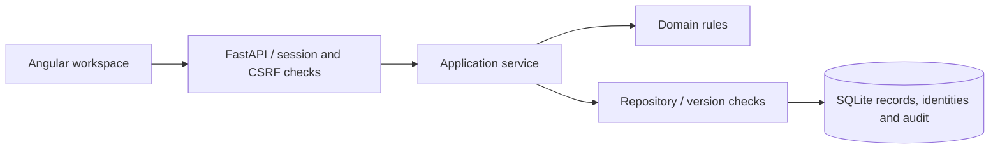

# Taskflow Platform architecture

## Domain boundary

Owned Kanban transitions: Tasks start in todo, advance through doing to done, and cannot advance beyond completion.

`backend/domain.py` owns the business rules. `backend/service.py` coordinates the domain, authorization and persistence. `backend/repository.py` owns SQL record operations; `backend/security.py` owns identities and sessions. `backend/api.py` translates typed HTTP requests into services. Angular uses typed services, reactive forms and role-aware panels.

## Decisions and alternatives

- **Modular application:** one deployable keeps local operation simple while domain, storage, security and transport remain separate. Independent microservices would add distributed transactions and operational overhead without a demonstrated scaling need.
- **SQLite transactions:** `BEGIN IMMEDIATE` makes validation, record creation, idempotency caching and audit insertion atomic. Migrations preserve existing records. Multiple replicas require a database and concurrency redesign; this example intentionally uses one writer.
- **Optimistic concurrency:** integer revisions and `If-Match` prevent stale clients from overwriting newer state. Conflict responses require a fresh read and a deliberate retry.
- **Opaque sessions:** random tokens are stored hashed, revoke on sign-out and expire. PBKDF2 password hashes use random salts. Cookies are HttpOnly, SameSite Strict and project-namespaced; production enables Secure.
- **Durable idempotency:** a user-scoped key and request fingerprint prevent duplicated creates. The original response is retained for 24 hours. Reusing a key for different input is a conflict.
- **Auditing and soft deletion:** mutation and audit write succeed together or roll back together. Deleted records leave the active list but remain recoverable by an operator. Audit rows are application-controlled, not an externally tamper-proof ledger.

## Failure boundaries

Network calls finish outside database write transactions. A stale result is rejected at the final compare-and-swap. External delivery and job execution are at least once, so downstream handlers must deduplicate using delivery IDs or their own operation keys. Session identity and role are checked on each request.

## Security boundaries

Viewers read, editors mutate and administrators manage roles, read audit history and approve workflows. The last administrator cannot be demoted. Unsafe requests require a permitted origin and CSRF token. Requests have body-size limits; login attempts are throttled; error payloads avoid echoing passwords.

Development tools that check URLs or deliver webhooks intentionally reach local HTTP services. For public hosting, restrict outbound hosts/IP ranges, block metadata and private networks as appropriate, and run with network policy. The public demo webhook receiver accepts JSON without authentication and stores nothing; replace it with verified signatures for an integration deployment.

## Next scaling decisions

Use PostgreSQL and tested migration tooling for multiple application replicas, a queue with leases for multiple workers, shared rate limiting, OIDC/MFA, monitored backups, centralized log retention, TLS ingress and outbound network controls. These are documented future changes, not claimed implemented features.
